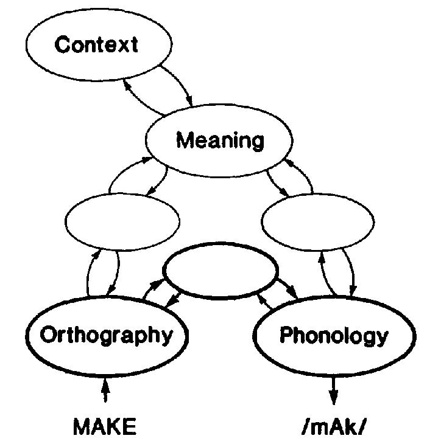

# wbai_aphasia

[WBA失語症ハンズオン「ことばの障害と脳」募集案内](https://wba-initiative.org/3163/)

WBAI (Whole Brain Architecture Initiative) Aphaisa Handson which will held at 17/Sep/2018

# 概要
全脳アーキテクチャ・イニシアティブ（WBAI）は、人類社会と調和する汎用人工知能の実現を長期的に支えるために設立された非営利活動
法人です。 
このハンズオンでは，「言語機能を脳の障害から理解する」をテーマとした複数チームの参加によるハッカソンを行います。期日は９月17
日を予定しています。ここで各チームは、複数の言語課題を解くたえの計算モデルに損傷を加えることにより，失語症（失読症）患者の示
す症状をシミュレートすることを目指します。神経心理学の研究によれば，(1)入力信号の処理系, (2)運動出力系，(3)意味処理系, の3者
の結合と相互作用を考えます。これらの機能処理系と，失読症の3タイプ，すなわち音韻失読，表層失読，深層失読，をコンピュータ上で
再現することを目指します。進化上，他の種には存在しないという意味で人間にしか持ち得なかった言語機能に光を当てることにより全脳
アーキテクチャの解明と完成に向けた一里塚となると考えます。

 

図 Seidenberg et al (1989)

本ハッカソンではニューラルネットワークによって構成された訓練済みの読字モデルを健常者の脳と捉えます。このモデルを部分的に破壊
することで上記３種類の失読症のタイプ，音韻失読，表層失読，深層失読を再現することを目指します。
入力は単語文字列とし，出力は音素系列とします。視覚野に提示された文字列が音声として出力される過程をシミュレートしたモデルに対
して，(1)一貫語と非一貫語，(2)実在語と非実在語, (3) 高頻度語と低頻度語, の区別により課題成績に差が認められるか否かを検証する
ことを目指します。

今回のハッカソンを通じて言語の多様性を表現することを通じて，健常者と脳損傷患者の脳とを総合的に説明するモデルを考えます。

## 開催情報

- 日時： 2018年9月17日月曜日
- 場所：φカフェ (https://phi.cafe/)
- テーマ: 多様な失語症状の理解
- 狙い

NPO法人全脳アーキテクチャ・イニシアティブでは、脳に学んだより汎用的な人工知能の開発に向けて、ハッカソンを行っています。脳に
学ぶ度合いを高めながら認知アーキテクチャを構築する方向に進んでいます。

# 体制
- 大会委員長（進捗管理）： 荒川直哉
- プログラム委員長： 浅川伸一
- 実行委員会： 武藤淳 浅川伸一
- テクニカルサポート：浅川伸一
- 課題作成チーム： 浅川伸一，武藤淳
- 審査委員会：浅川伸一，武藤淳，荒川直哉，山川宏
- スポンサー： フィールズ株式会社
- 撮影係：門前一馬
- 事務関係：荒川直哉
- 協力 : オフィスムディタ, 岩井健二，田中美徳
- 技術協力: 君津中央病院言語治療室

# 日程

- 7月31日：ミニハッカソン募集の開始：
- 8月08日: ミニ勉強会一般枠の募集開始：
- 8月12日：ハッカソン申し込み〆切
- 8月17日：ハッカソン採択通知：
- 9月1日: ミニ勉強会／事前説明会
- 9月17日: 当日

# 審査基準

WBAIとしては基本的には、以下の要件を満たすことにする。

- Functionally General： 三種類の失語症を一つのモデルで説明できる
- Biologically Plausible： 脳に近い形での拡張はWelcome
- Computationally Simple： 必要以上に複雑化しない
- 意味失読については，動物と非動物の二重乖離の再現
- 音韻失読と表層失読については，一貫語，非一貫語の区別，実在語，非実在語の成績の再現

# 文献

- Lichtheim, Ludwig. 1885. “On Aphasia.” Brain, 433–84.
- Seidenberg, Mark S., and James L. McClelland. 1989. “A Distributed, Developmental Model of Word Recognition and Naming.” Psychological Review 96 (4): 523–68.

## 注1: 一貫語と非一貫語
一貫語:多くの単語と文字と読みの規則が一致する単語。例:make, cake, lake,take..の ‘a’
非一貫語:文字と読みの規則が他の多く単語と一致しない単語。例:cat の ‘a’

## 注2: 二重乖離の原則
一方の認知機能Aが正常に保たれていて，他方の認知機能Bだけが選択的に障害を示す患者がいることに加えて，反対に認知機能Aだけに障害を示し，認知機能Bは正常の範囲である別の患者が存在する場合，この2つの認知機能  A と B とは二重に乖離している double dissociattion という。神経心理学の原則の一つ
深層失読では、動物カテゴリーの語に関する障害と非動物カテゴリーの語に関する障害の間の二重乖離を問題にする。
